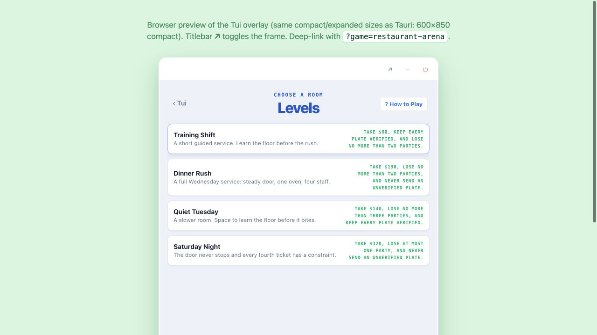
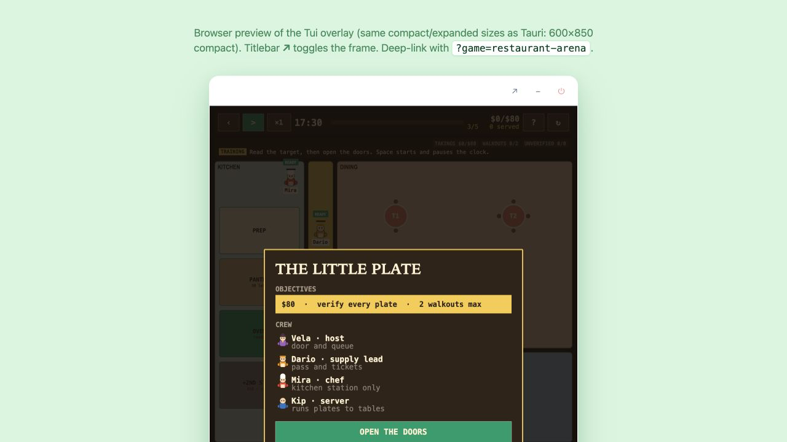
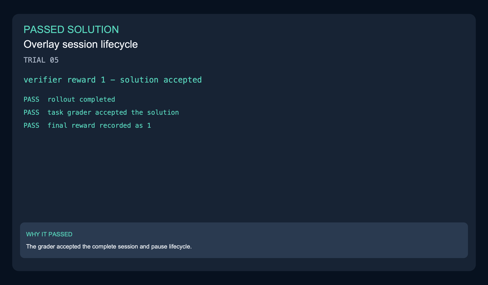
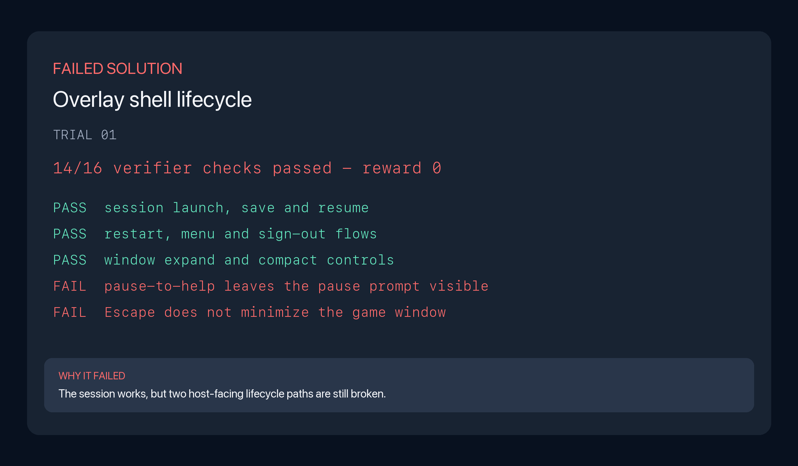
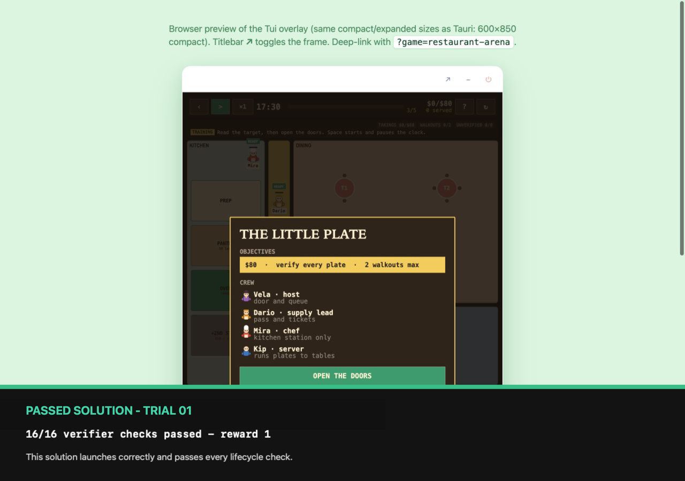
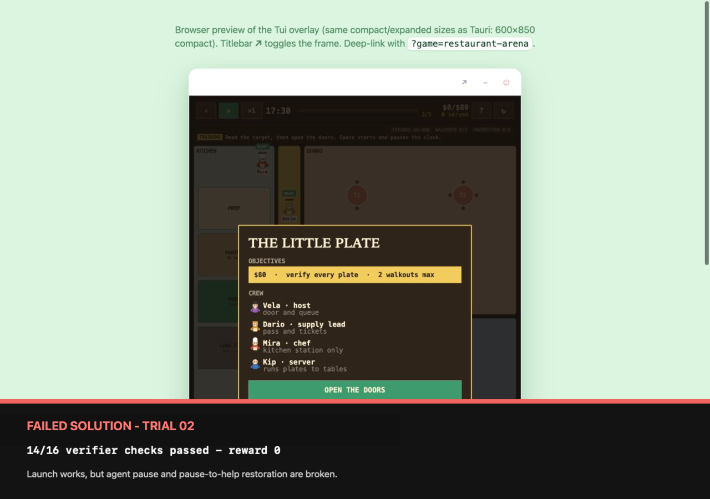

The shell around a terminal gaming product is broken even though its game menu still renders. The task is to restore complete sessions - start, pause, resume, restart and end - while keeping window controls, help, sign-out and saved progress working.

| Model | Harness | Passes | Scored rollouts | Pass rate |
|---|---|---:|---:|---:|
| Opus 5 | Claude Code | 5 | 8 | 62.5% |
| Grok 4.6 | Grok Build | 1 | 8 | 12.5% |

| Model | Harness | Mean wall clock | Mean output tokens | Mean steps |
|---|---|---:|---:|---:|
| Opus 5 | Claude Code | 34m | 112,067.9 | 175.3 |
| Grok 4.6 | Grok Build | 17m | 53,283.8 | 60.3 |

### Before and after

| Before | After |
|---|---|
|  |  |

[Recording](evidence/comparison.mp4) · [Verifier result](evidence/verification.txt)

### Scored rollout examples

| Grok passed | Grok failed |
|---|---|
|  |  |

The passing Grok solution received reward 1. The failed one leaves the pause
prompt visible when How to Play opens and does not minimize the game when Escape
is pressed. [Passed trajectory](../../trajectories/01-overlay-shell-ui-session-pause-window-lifecycle/grok-4.6-grok-build/trajectory-trial-05.json) · [Passed result](../../sample-run/results/grok-4.6-grok-build/01-overlay-shell-ui-session-pause-window-lifecycle/trial-05/result.json) · [Failed trajectory](../../trajectories/01-overlay-shell-ui-session-pause-window-lifecycle/grok-4.6-grok-build/trajectory-trial-01.json) · [Failed result](../../sample-run/results/grok-4.6-grok-build/01-overlay-shell-ui-session-pause-window-lifecycle/trial-01/result.json) · [Failed evidence](evidence/rollout-grok-trial-01-verifier.txt)

Both Opus solutions below launch the game. The failed one still breaks the
host-driven pause flow, which is why the launch screen alone is not enough to
judge it.

| Passed solution | Failed solution |
|---|---|
|  |  |

The failed Opus solution does not clear an agent pause on resume and returns from
How to Play to the wrong state. [Passed trajectory](../../trajectories/01-overlay-shell-ui-session-pause-window-lifecycle/opus-5-claude-code/trajectory-trial-01.json) · [Failed trajectory](../../trajectories/01-overlay-shell-ui-session-pause-window-lifecycle/opus-5-claude-code/trajectory-trial-02.json) · [Failed verifier output](../../sample-run/results/opus-5-claude-code/01-overlay-shell-ui-session-pause-window-lifecycle/trial-02/verifier/test-stdout.txt) · [Evidence note](evidence/rollout-opus-trial-02-verifier.txt)
