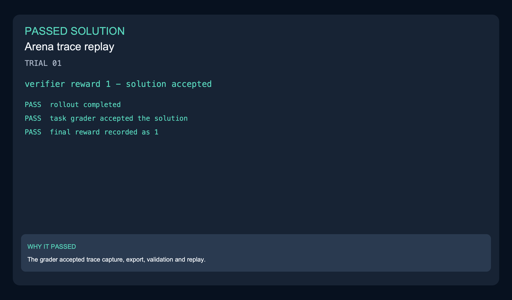
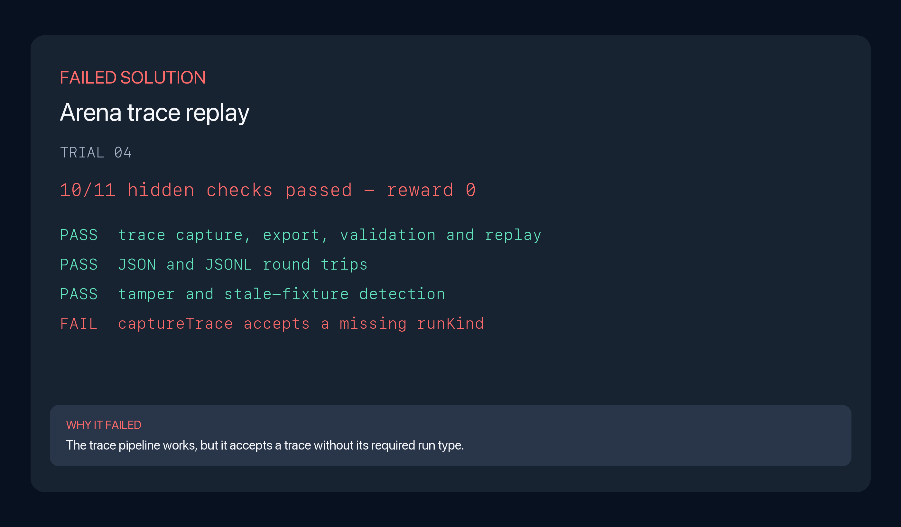
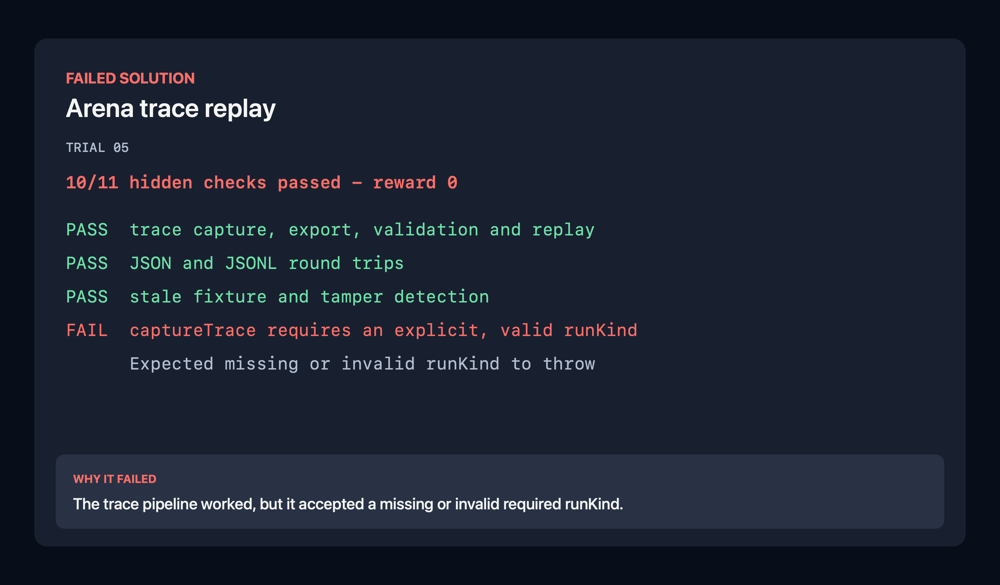

Restaurant Arena needs a reliable record of every live shift and a trustworthy way to replay it. The task covers schema-valid traces, JSON and JSONL export, checkpoint state, event history, player inputs, state hashes and final outcomes.

| Model | Harness | Passes | Scored rollouts | Pass rate |
|---|---|---:|---:|---:|
| Opus 5 | Claude Code | 7 | 8 | 87.5% |
| Grok 4.6 | Grok Build | 5 | 8 | 62.5% |

| Model | Harness | Mean wall clock | Mean output tokens | Mean steps |
|---|---|---:|---:|---:|
| Opus 5 | Claude Code | 21m | 81,085.3 | 96.6 |
| Grok 4.6 | Grok Build | 17m | 54,590.0 | 38.4 |

### Scored rollout examples

| Grok passed | Grok failed | Opus failed |
|---|---|---|
|  |  |  |

The passing Grok solution received reward 1. Both failed trace pipelines worked,
but accepted a missing required `runKind` instead of rejecting it. [Grok passed trajectory](../../trajectories/02-recording-trace-export-arena-trace-replay/grok-4.6-grok-build/trajectory-trial-01.json) · [Grok passed result](../../sample-run/results/grok-4.6-grok-build/02-recording-trace-export-arena-trace-replay/trial-01/result.json) · [Grok failed trajectory](../../trajectories/02-recording-trace-export-arena-trace-replay/grok-4.6-grok-build/trajectory-trial-04.json) · [Grok failed evidence](evidence/rollout-grok-trial-04-verifier.txt) · [Opus failed trajectory](../../trajectories/02-recording-trace-export-arena-trace-replay/opus-5-claude-code/trajectory-trial-05.json) · [Opus failed evidence](evidence/rollout-opus-trial-05-verifier.txt)
