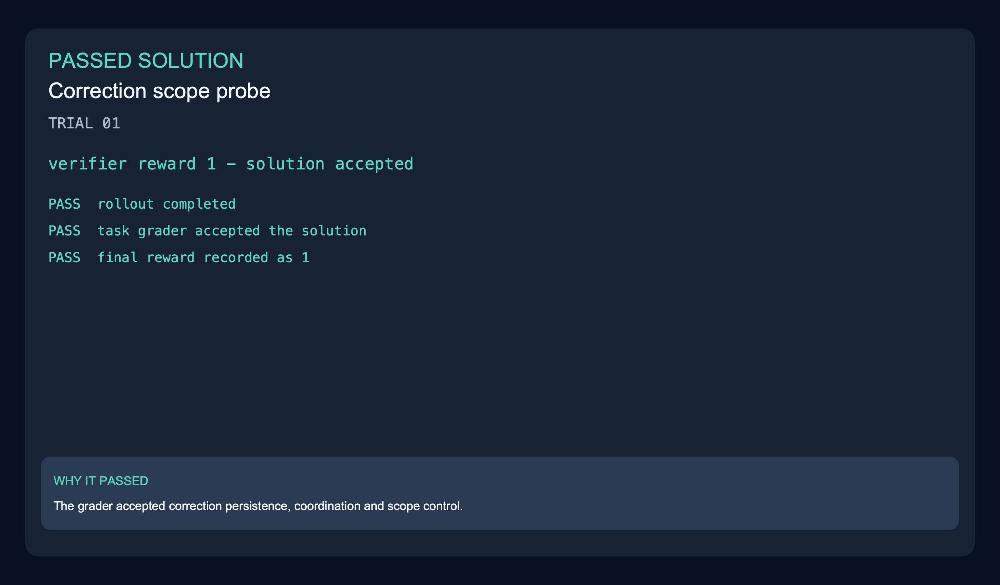
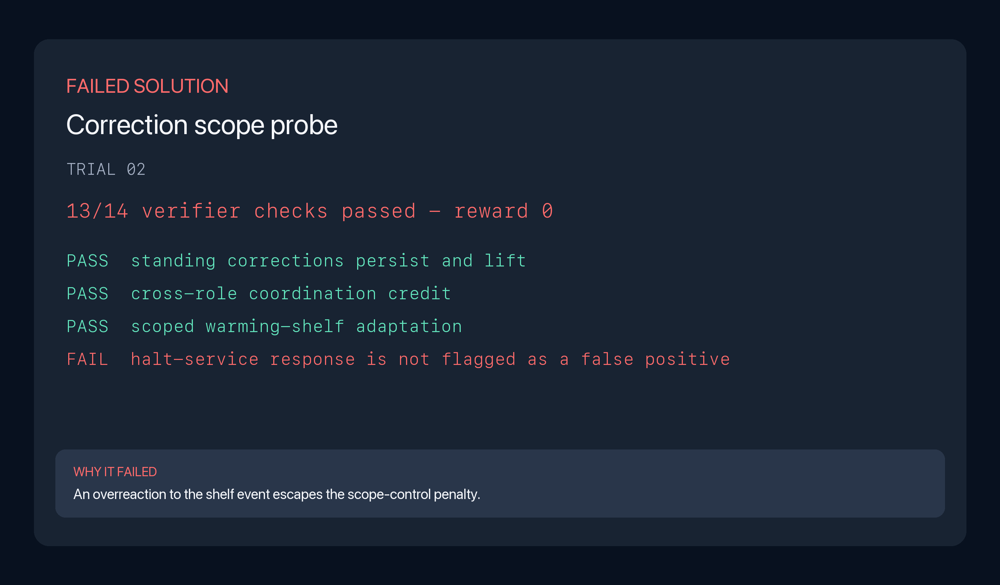
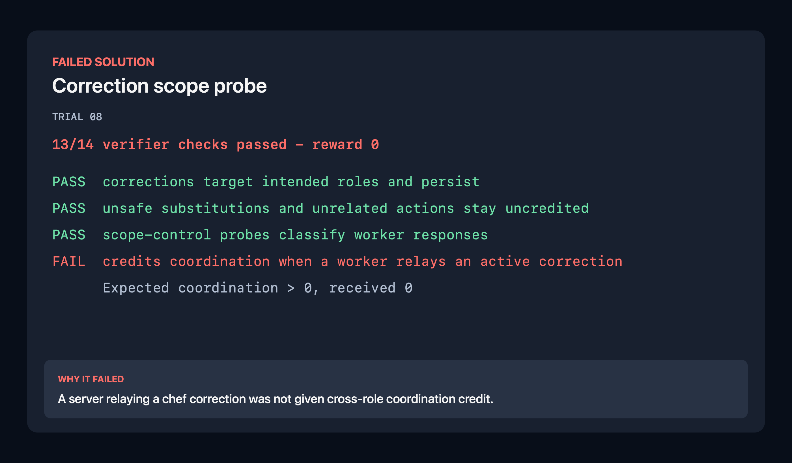

Mid-shift manager corrections in Restaurant Arena are logged but do not stay active or guide the right workers. This task makes corrections persist until lifted, constrains the intended actions, credits workers who follow them and avoids unrelated safety responses.

| Model | Harness | Passes | Scored rollouts | Pass rate |
|---|---|---:|---:|---:|
| Opus 5 | Claude Code | 6 | 8 | 75.0% |
| Grok 4.6 | Grok Build | 3 | 8 | 37.5% |

| Model | Harness | Mean wall clock | Mean output tokens | Mean steps |
|---|---|---:|---:|---:|
| Opus 5 | Claude Code | 25m | 85,463.0 | 130.8 |
| Grok 4.6 | Grok Build | 18m | 55,668.4 | 50.1 |

### Scored rollout examples

| Grok passed | Grok failed | Opus failed |
|---|---|---|
|  |  |  |

The passing Grok solution received reward 1. The failed Grok solution did not
penalize an explicit halt-service overreaction, while the Opus failure missed
coordination credit for a relayed correction. [Grok passed trajectory](../../trajectories/03-restaurant-arena-engine-correction-scope-probe/grok-4.6-grok-build/trajectory-trial-01.json) · [Grok passed result](../../sample-run/results/grok-4.6-grok-build/03-restaurant-arena-engine-correction-scope-probe/trial-01/result.json) · [Grok failed trajectory](../../trajectories/03-restaurant-arena-engine-correction-scope-probe/grok-4.6-grok-build/trajectory-trial-02.json) · [Grok failed evidence](evidence/rollout-grok-trial-02-verifier.txt) · [Opus failed trajectory](../../trajectories/03-restaurant-arena-engine-correction-scope-probe/opus-5-claude-code/trajectory-trial-08.json) · [Opus failed evidence](evidence/rollout-opus-trial-08-verifier.txt)
