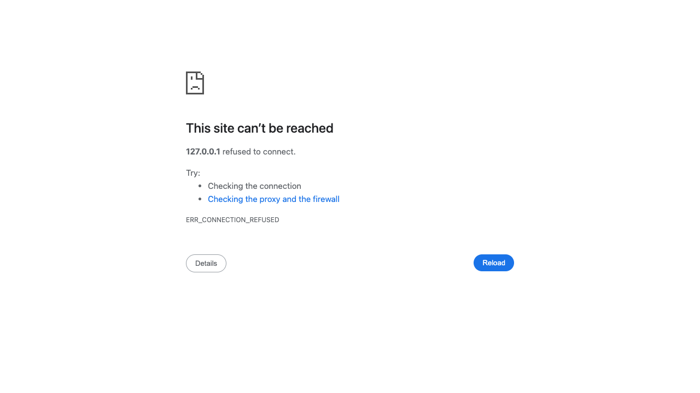
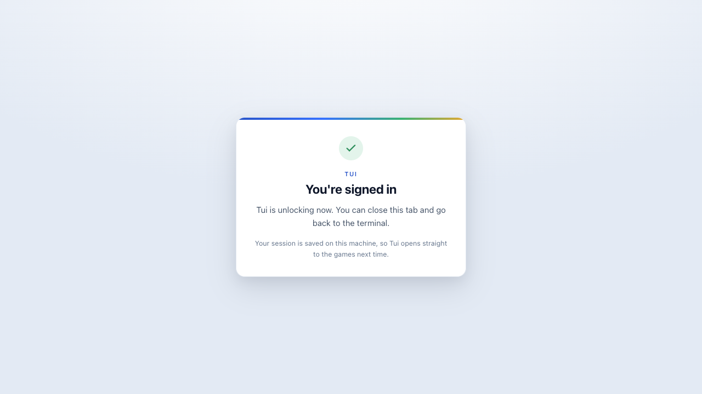
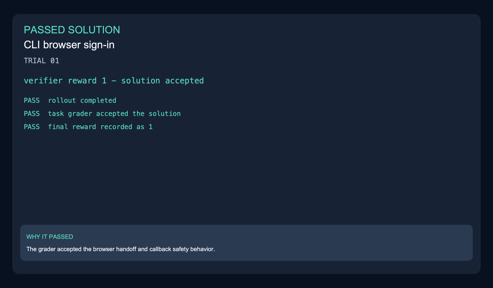
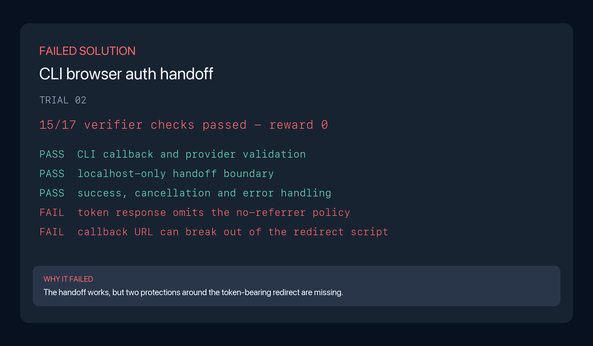
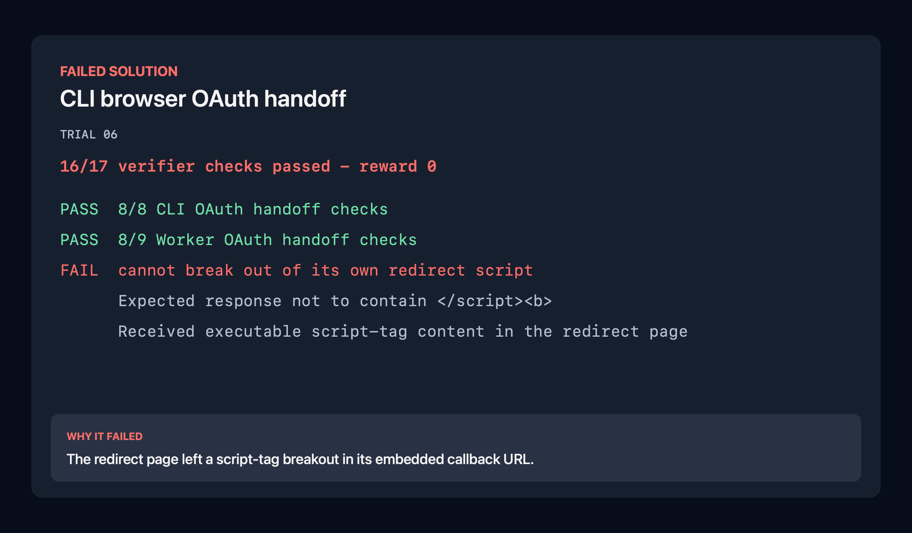

The gaming CLI needs Google and GitHub browser sign-in without weakening its local callback boundary. A complete fix opens the right browser, validates redirects, returns the authenticated session to the CLI and shows safe success, cancellation and error pages.

| Model | Harness | Passes | Scored rollouts | Pass rate |
|---|---|---:|---:|---:|
| Opus 5 | Claude Code | 6 | 8 | 75.0% |
| Grok 4.6 | Grok Build | 4 | 8 | 50.0% |

| Model | Harness | Mean wall clock | Mean output tokens | Mean steps |
|---|---|---:|---:|---:|
| Opus 5 | Claude Code | 19m | 67,822.1 | 87.5 |
| Grok 4.6 | Grok Build | 19m | 61,519.4 | 46.6 |

### Before and after

| Before — callback unavailable | After — successful sign-in callback |
|---|---|
|  |  |

The baseline has no CLI OAuth callback listener or page. The before image shows
the browser error when that callback URL is opened. The after image was captured
locally from the unmodified final code saved by the passing Grok trial 01, using
a fixture token. These are browser captures made from the saved implementation,
not screenshots recorded during the rollout or a live Google/GitHub login.

[Cancellation page](evidence/after-cancelled.png) · [Error page](evidence/after-error.png) · [Capture provenance](../../evidence-manifest.json) · [Baseline/reference verifier results](evidence/verification.txt)

### Scored rollout examples

| Grok passed | Grok failed | Opus failed |
|---|---|---|
|  |  |  |

The passing Grok solution received reward 1. The failed Grok solution kept a
script-tag injection issue and omitted the no-referrer policy; the Opus failure
kept the same injection path. [Grok passed trajectory](../../trajectories/04-auth-handoff-cli-browser-oauth/grok-4.6-grok-build/trajectory-trial-01.json) · [Grok passed result](../../sample-run/results/grok-4.6-grok-build/04-auth-handoff-cli-browser-oauth/trial-01/result.json) · [Grok failed trajectory](../../trajectories/04-auth-handoff-cli-browser-oauth/grok-4.6-grok-build/trajectory-trial-02.json) · [Grok failed evidence](evidence/rollout-grok-trial-02-verifier.txt) · [Opus failed trajectory](../../trajectories/04-auth-handoff-cli-browser-oauth/opus-5-claude-code/trajectory-trial-06.json) · [Opus failed evidence](evidence/rollout-opus-trial-06-verifier.txt)
