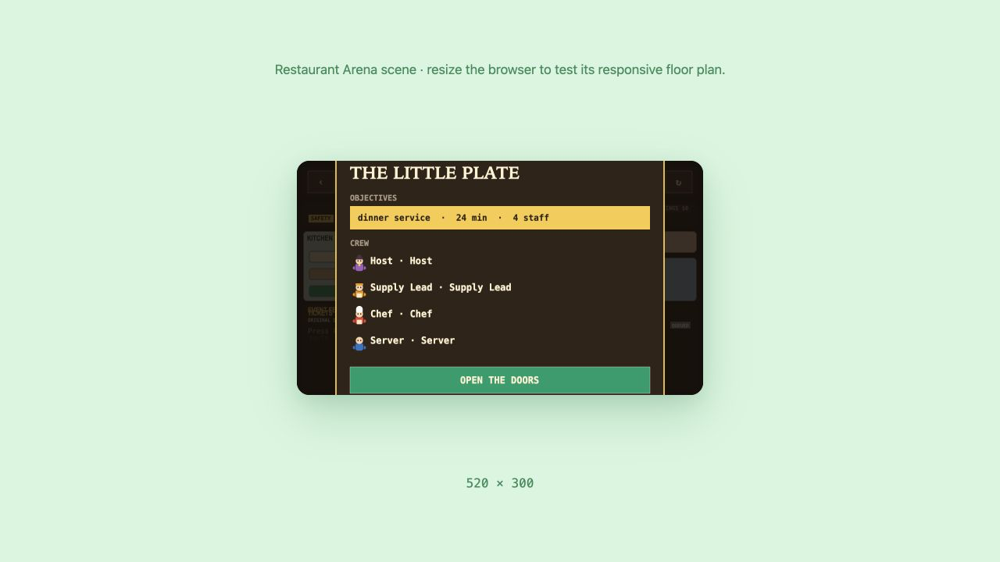
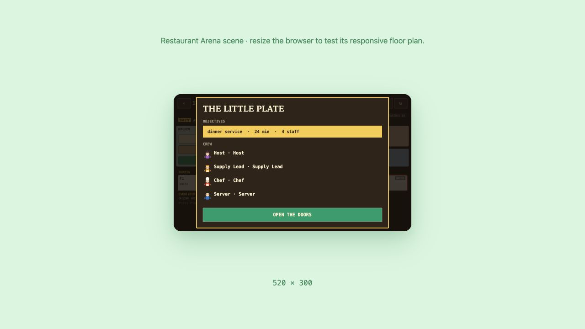
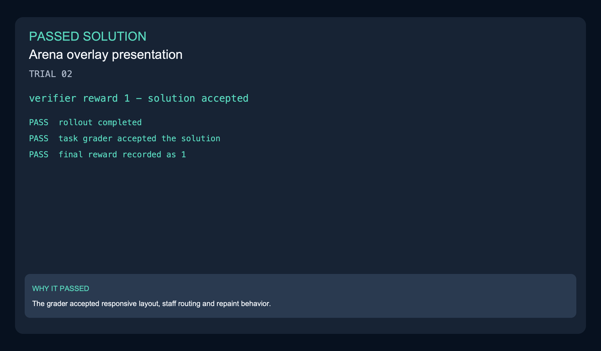
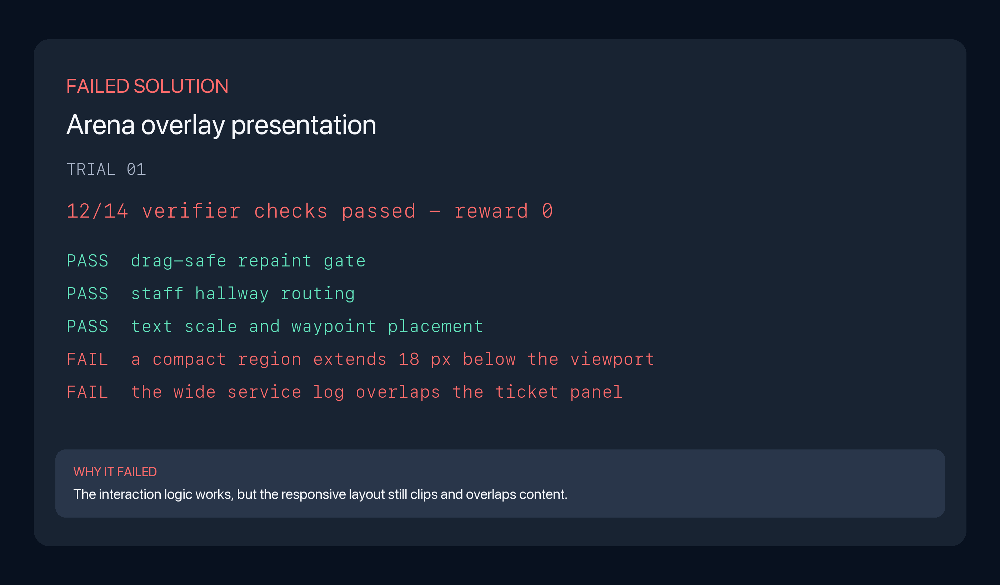
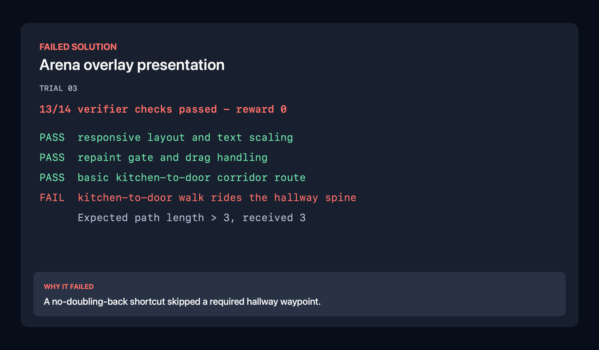

Restaurant Arena's overlay has lost its responsive layout, sensible staff movement and drag-safe repaint behavior. The task restores a readable floor at every supported window size, routes staff through hallways instead of rooms and defers one repaint while a staff token is being dragged.

| Model | Harness | Passes | Scored rollouts | Pass rate |
|---|---|---:|---:|---:|
| Opus 5 | Claude Code | 7 | 8 | 87.5% |
| Grok 4.6 | Grok Build | 2 | 8 | 25.0% |

| Model | Harness | Mean wall clock | Mean output tokens | Mean steps |
|---|---|---:|---:|---:|
| Opus 5 | Claude Code | 23m | 89,878.5 | 103.1 |
| Grok 4.6 | Grok Build | 17m | 58,604.3 | 32.0 |

### Before and after

| Before | After |
|---|---|
|  |  |

[Recording](evidence/comparison.mp4) · [Verifier result](evidence/verification.txt)

### Scored rollout examples

| Grok passed | Grok failed | Opus failed |
|---|---|---|
|  |  |  |

The passing Grok solution received reward 1. The failed Grok solution kept the
walk and repaint behavior but clipped a compact region and overlapped the wide
service log; the Opus failure skipped a hallway waypoint. [Grok passed trajectory](../../trajectories/05-arena-overlay-presentation-layout-staff-walk-repaint-gate/grok-4.6-grok-build/trajectory-trial-02.json) · [Grok passed result](../../sample-run/results/grok-4.6-grok-build/05-arena-overlay-presentation-layout-staff-walk-repaint-gate/trial-02/result.json) · [Grok failed trajectory](../../trajectories/05-arena-overlay-presentation-layout-staff-walk-repaint-gate/grok-4.6-grok-build/trajectory-trial-01.json) · [Grok failed evidence](evidence/rollout-grok-trial-01-verifier.txt) · [Opus failed trajectory](../../trajectories/05-arena-overlay-presentation-layout-staff-walk-repaint-gate/opus-5-claude-code/trajectory-trial-03.json) · [Opus failed evidence](evidence/rollout-opus-trial-03-verifier.txt)
